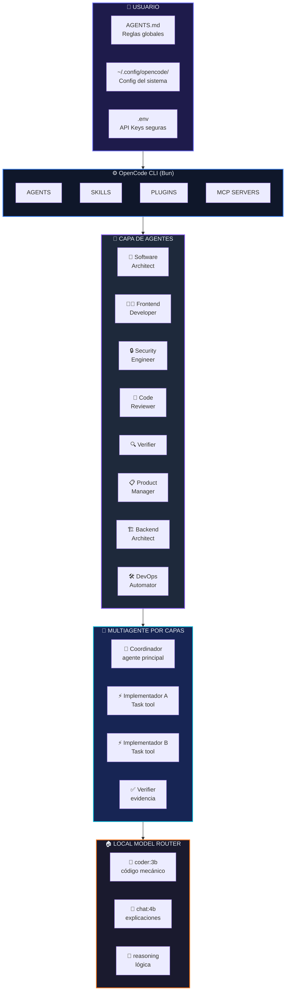
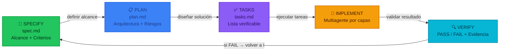
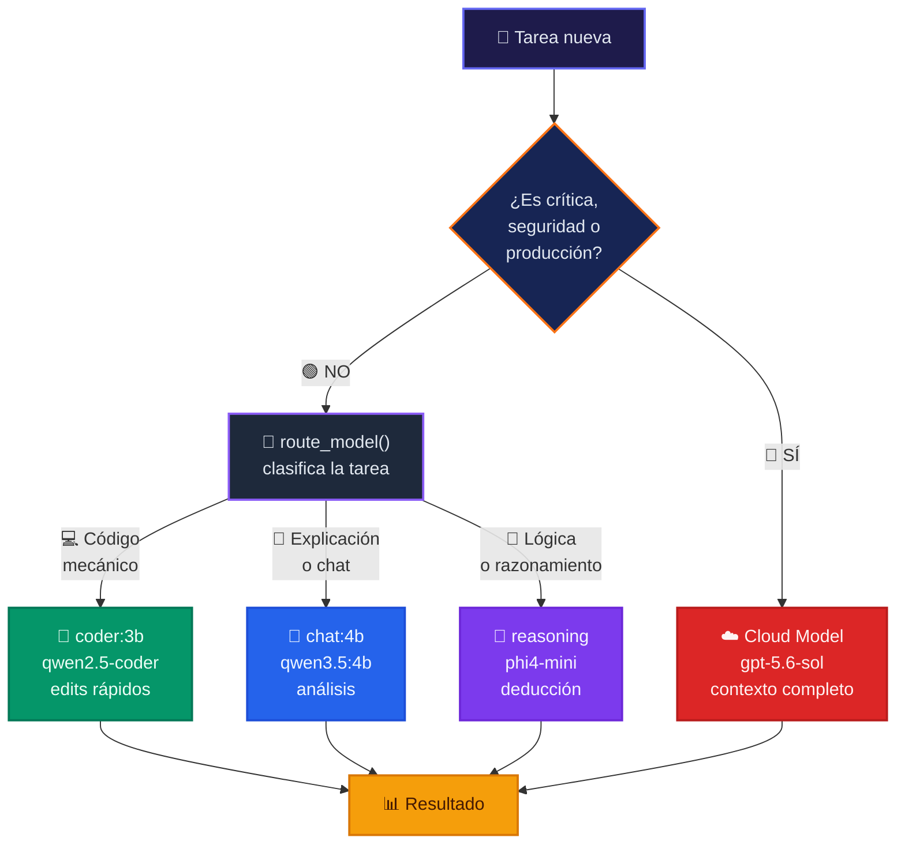

<div align="center">

<!-- === HERO === -->


<br/>

#  OpenCode Config Backup

### <sub>Tu estación de trabajo de IA completa. Portable. Potente. Ahorrador de tokens.</sub>

<br/>

<a href="https://github.com/Rukawua26/opencode-config-backup">
  
</a>
<a href="https://github.com/Rukawua26/opencode-config-backup/blob/main/install.sh">
  
</a>
<a href="https://github.com/Rukawua26/opencode-config-backup#arquitectura">
  
</a>
<a href="https://github.com/Rukawua26/opencode-config-backup#componentes">
  
</a>
<a href="https://github.com/Rukawua26/opencode-config-backup#perfiles">
  
</a>
<a href="https://github.com/Rukawua26/opencode-config-backup#componentes">
  
</a>
<a href="https://github.com/Rukawua26/opencode-config-backup#componentes">
  
</a>

<br/>

<a href="#-arquitectura"></a>
<a href="#-flujo-sdd"></a>
<a href="#-ruteo-de-modelos"></a>
<a href="#-perfiles"></a>

</div>

---

<br/>

## ✨ Características principales

<div align="center">
<table>
  <tr>
    <td align="center" width="20%">
      <br/>
      <strong><sub>16 Agentes</sub></strong><br/>
      <sub>Seleccionados de 233</sub>
    </td>
    <td align="center" width="20%">
      <br/>
      <strong><sub>20 Skills</sub></strong><br/>
      <sub>Ciclo SDD completo</sub>
    </td>
    <td align="center" width="20%">
      <br/>
      <strong><sub>8 Plugins</sub></strong><br/>
      <sub>Guardrails + Kanban + Sandbox</sub>
    </td>
    <td align="center" width="20%">
      <br/>
      <strong><sub>5 MCPs</sub></strong><br/>
      <sub>Ollama + Memoria + Docs</sub>
    </td>
    <td align="center" width="20%">
      <br/>
      <strong><sub>3 Perfiles</sub></strong><br/>
      <sub>Work / Personal / Light</sub>
    </td>
  </tr>
</table>
</div>

---

<br/>

## 🏗️ Arquitectura

<div align="center">
  
</div>

<div align="center">



</div>

---

<br/>

## 🔄 Flujo SDD (Spec-Driven Development)

<div align="center">
  
</div>

<div align="center">



</div>

**Cómo funciona:**
1. 📝 **Spec**: Define qué se construye y qué éxito significa
2. 📋 **Plan**: Diseña la solución técnica con alternativas
3. ✅ **Tasks**: Descompone en tareas pequeñas y verificables
4. 🔨 **Implement**: Subagentes ejecutan tareas aisladas
5. 🔍 **Verify**: Verificador confirma con evidencia independiente

### Organic RDD

Organic RDD revisa el candidato despues de implementarlo y adapta la ceremonia al riesgo real:

- **Tier 0**: documentacion, sin revision adicional
- **Tier 1**: skills y commands, `code-review` + verificacion
- **Tier 2**: configuracion central, `code-review` + `verifier` + verificacion
- **Tier 3**: runtime, permisos, seguridad, persistencia o gates; agrega lentes especializadas

Los receipts canonicos viven en `~/.local/share/opencode/plugins-data/organic-rdd/`. El gate es manual en el MVP. `review mode=disabled` produce `unmanaged`, nunca `approved`.

Limitaciones MVP:

- El projection principal es `explicit-files`: el receipt certifica los archivos listados, no todo el workspace.
- En repos Git, `review_start` guarda `git.head`, archivos cambiados y advertencias cuando hay cambios fuera del manifest.
- `review_gate` mantiene compatibilidad por defecto; usa `strict_manifest=true` para fallar si Git detecta archivos omitidos.
- Las eliminaciones Git se reportan como `manifest_has_deletions`; `explicit-files` no puede hashear archivos eliminados, asi que strict mode las bloquea hasta una futura proyeccion Git.
- No se instalan hooks automaticamente y el store local confia en el mismo usuario del sistema.

---

<br/>

## 🧠 Ruteo de Modelos

<div align="center">
  
</div>

<div align="center">



</div>

> **⚠️ Regla de seguridad**: Los modelos locales siempre se tratan como datos no confiables. Nunca ejecutan tools, acceden a secretos ni cambian estado solo por sus instrucciones.

---

<br/>

## 🎯 Perfiles

<div align="center">
<table>
  <tr>
    <th width="25%"></th>
    <th width="25%">
      
    </th>
    <th width="25%">
      
    </th>
    <th width="25%">
      
    </th>
  </tr>
  <tr>
    <td><strong>🧠 Modelo</strong></td>
    <td><code>gpt-5.6-sol</code></td>
    <td><code>gpt-5.4-mini</code></td>
    <td><code>gpt-5.4-mini</code></td>
  </tr>
  <tr>
    <td><strong>🔌 Plugins</strong></td>
    <td></td>
    <td></td>
    <td></td>
  </tr>
  <tr>
    <td><strong>📦 Compactación</strong></td>
    <td><code>tail_turns: 6</code></td>
    <td><code>tail_turns: 4</code></td>
    <td><code>tail_turns: 3</code></td>
  </tr>
  <tr>
    <td><strong>📏 Salida tools</strong></td>
    <td>200 líneas / 8 KiB</td>
    <td>120 líneas / 8 KiB</td>
    <td>80 líneas / 4 KiB</td>
  </tr>
  <tr>
    <td><strong>📡 MCP</strong></td>
    <td></td>
    <td></td>
    <td></td>
  </tr>
  <tr>
    <td><strong>🎯 Ideal para</strong></td>
    <td>Features complejas</td>
    <td>Tareas mecánicas</td>
    <td>Búsqueda rápida</td>
  </tr>
</table>
</div>

```bash
opencode-profile   # 🎯 menú interactivo
opencode-work      # 💼 perfil completo (premium)
opencode-personal  # ⚡ perfil económico
```

---

<br/>

## 🚀 Instalación

<div align="center">
  
</div>

<br/>

```bash
# 1️⃣ Clonar el repositorio
git clone https://github.com/Rukawua26/opencode-config-backup.git
cd opencode-config-backup

# 2️⃣ Ejecutar el instalador
./install.sh

# 3️⃣ Configurar API keys y reiniciar
nano ~/.config/opencode/.env
# Agrega tus keys → reinicia OpenCode
```

<div align="center">
<table>
  <tr><th>✅ El script hace automáticamente:</th></tr>
  <tr><td>📦 Backup de config existente en <code>~/.config/opencode.backup.&lt;timestamp&gt;</code></td></tr>
  <tr><td>📁 Copia config a <code>~/.config/opencode/</code></td></tr>
  <tr><td>🧩 Copia skills a <code>~/opencode-custom/skills/</code></td></tr>
  <tr><td>📋 Copia reglas a <code>~/AGENTS.md</code></td></tr>
  <tr><td>🔄 Reemplaza <code>__HOME__</code> por tu home real</td></tr>
  <tr><td>🔗 Reconecta symlinks de agents</td></tr>
  <tr><td>📦 Instala dependencias npm</td></tr>
</table>
</div>

---

<br/>

## 🧩 Componentes

### 🔌 Plugins

<div align="center">
<table>
  <tr>
    <td></td>
    <td><sub>Personalidades vía SOUL.md</sub></td>
    <td></td>
    <td><sub>Anti-loop y detección de errores</sub></td>
  </tr>
  <tr>
    <td></td>
    <td><sub>Snapshots antes de edits</sub></td>
    <td></td>
    <td><sub>Tablero de tareas integrado</sub></td>
  </tr>
  <tr>
    <td></td>
    <td><sub>Ejecución aislada en Docker</sub></td>
    <td></td>
    <td><sub>Validación de API keys en startup</sub></td>
  </tr>
  <tr>
    <td></td>
    <td><sub>Métricas de sesiones y tokens</sub></td>
    <td></td>
    <td><sub>Review por riesgo con receipts y gates</sub></td>
  </tr>
</table>
</div>

### ⚡ Skills

<div align="center">
<table>
  <tr>
    <td></td>
    <td></td>
    <td></td>
    <td></td>
    <td></td>
    <td></td>
  </tr>
  <tr>
    <td></td>
    <td></td>
    <td></td>
    <td></td>
    <td></td>
    <td></td>
  </tr>
  <tr>
    <td></td>
    <td></td>
    <td></td>
    <td></td>
    <td></td>
    <td></td>
  </tr>
  <tr>
    <td></td>
    <td></td>
  </tr>
</table>
</div>

### 📡 MCP Servers

<div align="center">
<table>
  <tr>
    <th>Servidor</th>
    <th>Estado</th>
    <th>Descripción</th>
  </tr>
  <tr>
    <td><code>local-model-router</code></td>
    <td></td>
    <td>Ollama local bajo demanda</td>
  </tr>
  <tr>
    <td><code>memory-adapter</code></td>
    <td></td>
    <td>Memoria técnica persistente</td>
  </tr>
  <tr>
    <td><code>context7</code></td>
    <td></td>
    <td>Docs de librerías actualizadas</td>
  </tr>
  <tr>
    <td><code>diagram-generator</code></td>
    <td></td>
    <td>Draw.io / Mermaid / Excalidraw</td>
  </tr>
  <tr>
    <td><code>playwright</code></td>
    <td></td>
    <td>Automatización de navegador</td>
  </tr>
</table>
</div>

---

<br/>

## 🛡️ Seguridad

<div align="center">
<table>
  <tr>
    <td></td>
  </tr>
</table>
</div>

- 🚫 `.env` **nunca** se sube (está en `.gitignore`)
- 🚫 `node_modules/` **nunca** se sube
- ✅ `memory.db` y `kanban.json` se suben (estado portable)
- ⚠️ Modelos locales tratados como **datos no confiables**
- 🔒 Agentes con permisos de escritura **restringidos por defecto**

> ⚠️ **Revisa** los archivos de estado antes de publicar un fork, ya que pueden contener información de trabajo.

---

<br/>

## 📂 Estructura del repositorio

```
opencode-config-backup/
├── 🤖 agents/                    # 16 agentes activos (symlinks)
├── 📚 agents-library/            # 233 agentes disponibles
├── ⚡ skills/                    # 20 skills SDD + utilidades
├── 🔌 plugins/                   # 8 plugins activos
│   ├── personalities.js          # 🎭 Personalidades
│   ├── guardrails.js             # 🛡️ Anti-loop
│   ├── checkpoints.js            # 💾 Snapshots
│   ├── kanban.js                 # 📋 Tablero
│   ├── sandbox.js                # 🐳 Docker
│   ├── validator.js              # 🔑 API keys
│   ├── session-metrics.js        # 📊 Métricas
│   └── organic-rdd.js            # Review por riesgo
├── 📡 mcp/                       # 5 servidores MCP
│   ├── local-model-router.js     # 🔀 Router Ollama
│   └── memory-adapter/           # 💾 Memoria persistente
├── 🎯 profiles/
│   ├── work/opencode.jsonc       # 💼 Perfil completo
│   ├── personal/opencode.jsonc   # ⚡ Perfil económico
│   └── light/opencode.jsonc      # 🚀 Perfil ultrarrápido
├── 📋 AGENTS.md                  # Reglas globales del agente
├── 🚀 install.sh                 # Instalador portátil
└── ⚙️ opencode.jsonc             # Config central
```

---

<br/>

<div align="center">
  
  <br/>
  <strong>Creado por</strong> <a href="https://github.com/Rukawua26"></a>
  <br/><br/>
  <sub>Configuración portátil de OpenCode · Optimizada para ahorro de tokens</sub>
</div>
