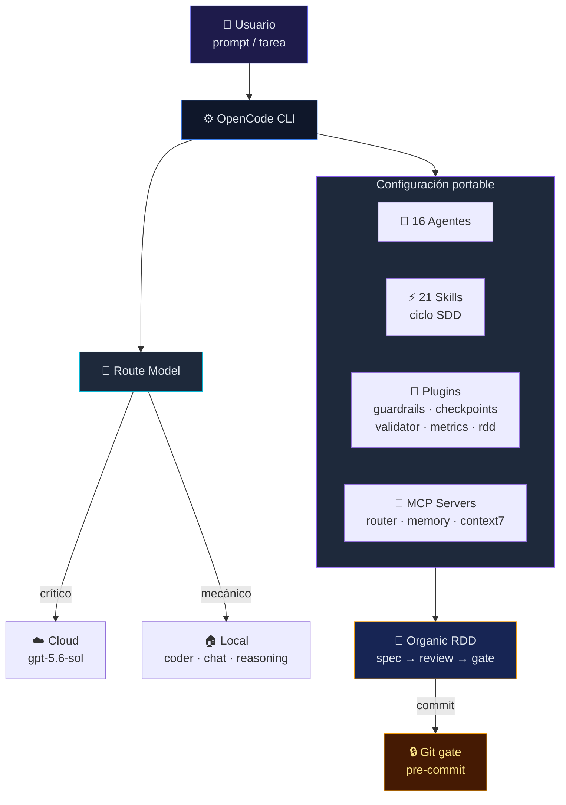
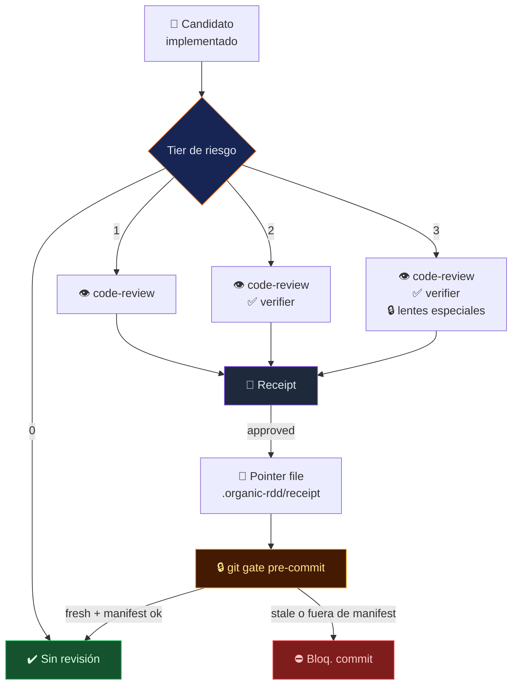
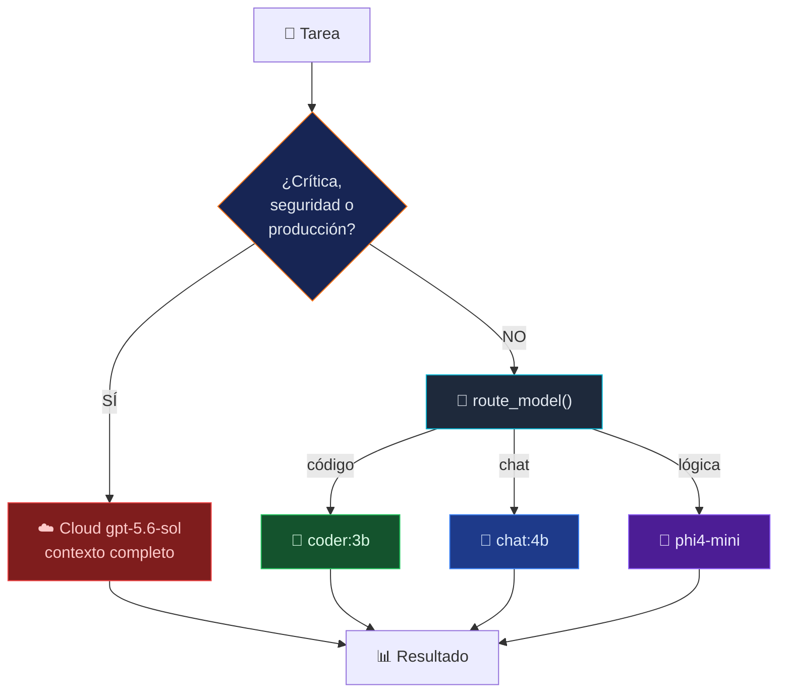

<div align="center">

#  OpenDotfile

### <sub>Estación de trabajo de IA portable, completa y optimizada para ahorro de tokens.</sub>

</div>

> [!CAUTION]
> **Repositorio historicico (archivado).** OpenDotfile se fusionó en
> [OpenCode Ecosystem](https://github.com/Rukawua26/opencode-ecosystem),
> que ahora es la unica fuente canónica (instalador, perfiles, plugins,
> memoria, router y Organic RDD con lineage/receipts/refuter). No ejecutes
> `install.sh` desde este repositorio para nuevas instalaciones; el contenido
> se conserva únicamente como referencia histórica.

---

## ✨ Qué es

Configuración portable de OpenCode con 16 agentes, 15 skills, 5 plugins esenciales, perfiles y MCP servers. Todo el ciclo SDD (spec → plan → tasks → implement → verify) con review por riesgo mediante Organic RDD.

### Cómo funciona



---

## 🚀 Instalación

```bash
# 1️⃣ Clonar el repositorio
git clone https://github.com/Rukawua26/opendotfile.git
cd opendotfile

# 2️⃣ Ejecutar el instalador
./install.sh

# 3️⃣ Configurar API keys y reiniciar
nano ~/.config/opencode/.env
```

El script hace automáticamente: backup de la config existente, copia a `~/.config/opencode/`, skills a `~/opencode-custom/skills/`, reemplaza `__HOME__` por tu home real, reconecta symlinks de agents e instala dependencias npm.

Para habilitar el provider principal, configura localmente `OPENAI_API_KEY` en `~/.config/opencode/.env`. Anthropic (`ANTHROPIC_API_KEY`) es opcional.

---

## 🎯 Perfiles

| | 💼 Work | ⚡ Personal | 🚀 Light |
|---|---|---|---|
| **Modelo** | `gpt-5.6-sol` | `gpt-5.4-mini` | `gpt-5.4-mini` |
| **Plugins** | 9 | 6 | 5 |
| **MCP** | 4 servidores | sin MCP | sin MCP |
| **Ideal para** | Features complejas | Tareas mecánicas | Búsqueda rápida |

```bash
opencode-profile   # menú interactivo
opencode-work      # perfil completo
opencode-personal  # perfil económico
```

---

## 🔄 Flujo SDD


1. **Spec** → define alcance y criterios de éxito
2. **Plan** → diseña la solución técnica
3. **Tasks** → descompone en tareas verificables
4. **Implement** → subagentes ejecutan tareas aisladas
5. **Verify** → verificador confirma con evidencia independiente

### Organic RDD



Review del candidato adaptado al riesgo real:

- **Tier 0**: documentación, sin revisión adicional
- **Tier 1**: skills y commands → `code-review` + verificación
- **Tier 2**: configuración central → `code-review` + `verifier`
- **Tier 3**: runtime, permisos, seguridad o gates → lentes especializadas

Receipts en `~/.local/share/opencode/plugins-data/organic-rdd/`. Incluye identidad de proyecto (`project_id = sha256(project_path)`), validación read-only (`review_validate`) y un **git gate pre-commit** que bloquea commits con candidatos stale o archivos staged fuera del manifest (instala con `./install.sh --with-git-gate`). `review mode=disabled` produce `unmanaged`, nunca `approved`.

---

## 🧠 Ruteo de Modelos



- **Crítico/seguridad/producción** → modelo cloud completo
- **Código mecánico** → `coder:3b` (local)
- **Explicaciones** → `chat:4b` (local)
- **Lógica/razonamiento** → `phi4-mini` (local)

> ⚠️ Los modelos locales siempre se tratan como **datos no confiables**: nunca ejecutan tools ni acceden a secretos por su cuenta.

---

## 🧩 Componentes

**Plugins esenciales** (`plugins/`): `guardrails.js` (anti-loop), `checkpoints.js` (snapshots), `validator.js` (API keys), `session-metrics.js` (métricas), `organic-rdd.js` (review por riesgo).

**Plugins opcionales** (`plugins-optional/`, pendientes de hardening): `personalities.js`, `kanban.js`, `sandbox.js`, `auto-memory.js`.

**Retirado**: `memory-v2.js` (incompatible con Bun). Reemplazado por `memory-adapter` MCP (`node:sqlite`, sin deps externas). MCP read-only; escrituras solo vía CLI explícita.

**MCP servers** (`mcp/`): `local-model-router` (Ollama, activo por defecto), `memory-adapter` (memoria persistente, work), `context7` (docs de librerías, work), `diagram-generator` (Draw.io/Mermaid, work), `playwright` (off por defecto).

---

## 🛡️ Seguridad

- `.env` y `node_modules/` nunca se suben
- `memory.db` y `kanban.json` sí se suben (estado portable)
- Modelos locales tratados como datos no confiables
- Agentes con permisos de escritura restringidos por defecto

---

## 📂 Estructura

```
opendotfile/
├── agents/                  # 16 agentes activos (symlinks)
├── agents-library/          # 233 agentes disponibles
├── skills/                  # 21 skills SDD + utilidades
├── plugins/                 # 5 esenciales (siempre activos)
├── plugins-optional/        # 4 opcionales por perfil
├── plugins-disabled/        # hooks.js, memory-v2.js
├── mcp/                     # 5 servidores MCP
├── lib/                     # organic-rdd.js y helpers
├── hooks/                   # git gate pre-commit
├── tests/                   # 9 suites
├── profiles/                # work / personal / light
├── spec/features/           # 9 features SDD (001-009)
├── commands/                # /spec, /review-validate, ...
├── AGENTS.md                # reglas globales del agente
├── install.sh               # instalador portátil
└── opencode.jsonc           # config central
```

---

<div align="center">
  <sub>Configuración portátil de OpenCode · Optimizada para ahorro de tokens</sub>
</div>
